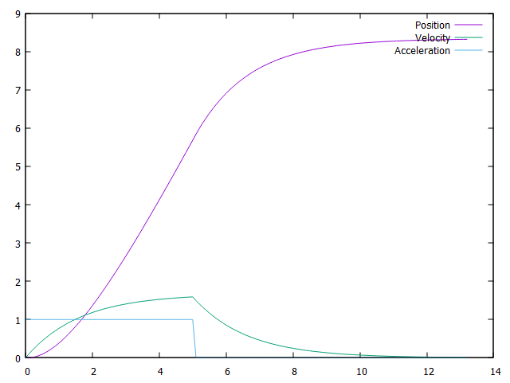

# Control

Implementing concepts from MECHTRON 4AX3 - Predictive and Intelligent Control.

## Examples

## LTI

Simulates a car accelerating and coasting with drag. Accepts two arguments: `<drag> <timestep>`.

### Usage

```bash
make examples/lti.cpp
./build/examples/lti.exe 0.6 0.1 > lti.out
gnuplot examples/lti.plot
```



## Roadmap

- ~~Linear Least Squares via Normal Equation~~
- ~~Gradient Descent solver~~
- ~~State space classes & solving methods~~
- Kalman Filter
- Luenberger Observer
- Extended Kalman filter
  - Is this code any different than the standard KF?
- Control
  - Converging to optimal policy
  - Learning
  - Exploration
