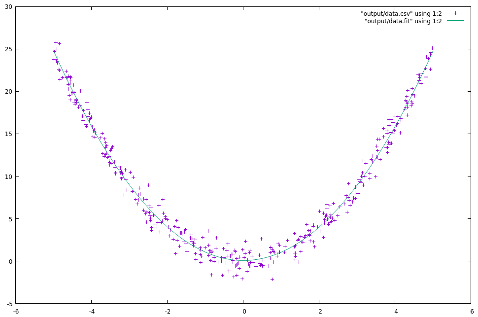

# Linear Least Squares

Calculate and plot the best polynomial through a set of noisy data points.



## Requirements

Must have `gnuplot` available to your shell.

## Generate Data

Data is generated about the `y=x^2` parabola. Gaussian noise scaled by `stdev` is added to `y`.

```bash
cargo run -- generate --stdev 1.0 --num-points 400 --output-file output/data.csv
```

## Fit a Polynomial and Plot

Specify the input data (from `generate`) and the degree of polynomial to fit.

```bash
cargo run -- fit --input-file output/data.csv --degree 2
```

This will open `gnuplot` to show the noisy data vs polynomial fit.

You "should" use degree 2 to fit this model since it is generated off of a parabola. The reason it is included as a parameter is to demonstrate how an incorrect model can overfit the data, especially when `num-points` is small.

