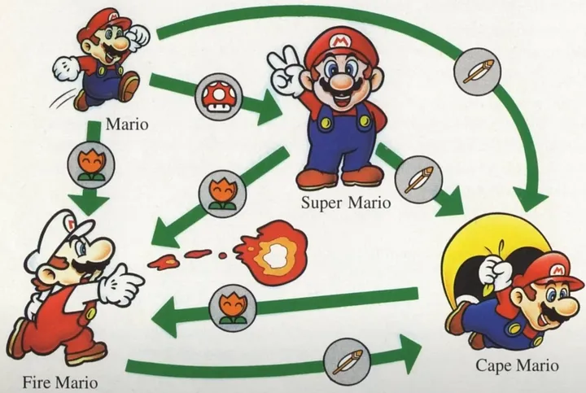

# Mario Webserver

No Boilerplate released a video on implementing a [state machine with Rust's type system](https://www.youtube.com/watch?v=z-0-bbc80JM) which used this Mario transition table as an example.

I will combine this example with the [web server tutorial](https://doc.rust-lang.org/book/ch20-00-final-project-a-web-server.html) from the Rust Book. Transitions will be triggered by different requests and states will be shown in the HTML.

## Example

The server boots to the Mario state. If the user requests `/mushroom` then the state will transition to Super Mario, and so on for the other states `/mushroom` then the state will transition to Super Mario, and so on for the other states.

I will add two additional transitions: `/damage` which will send `Fire/Cape -> Super -> Mario -> Dead` and `/revive` to go from `Dead -> Mario`.
